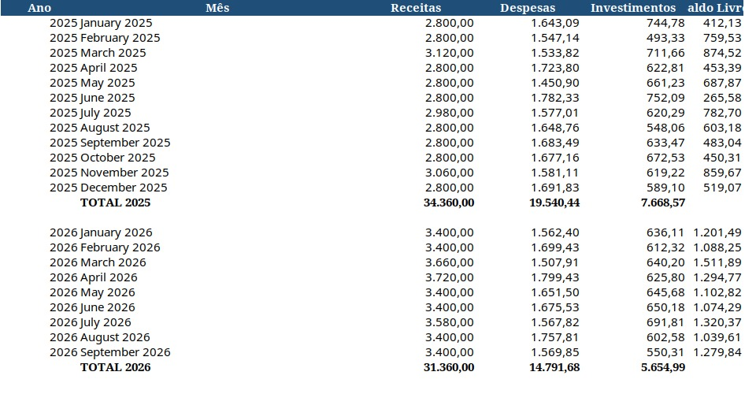
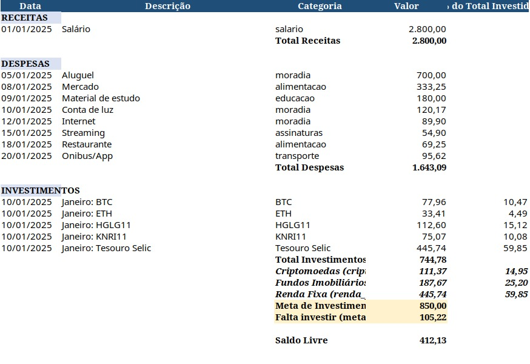
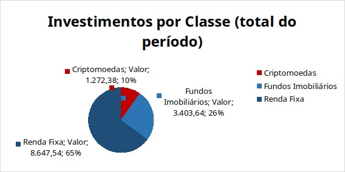
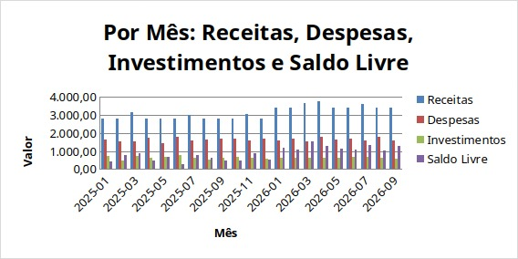

# controleGastos


Ferramenta de linha de comando para **controle de gastos pessoais**, que gera planilhas Excel (.xlsx) organizando **receitas**, **despesas** e **investimentos** por mês e por ano.

## Demonstração

Capturas de uma planilha gerada a partir de dados de exemplo (fictícios). As imagens ficam em `docs/media/`.

### Resumo Geral



Totais de receitas, despesas, investimentos e saldo livre por mês/ano.

### Aba do mês



Lançamentos do mês com receitas, despesas e investimentos — incluindo o ativo, o % do total investido, subtotal e % por classe (renda fixa, FIIs, cripto) e a comparação com a meta do mês.

### Gráficos



Distribuição do total investido por classe de ativo.



Receitas, despesas, investimentos e saldo livre por mês.

## Como funciona

```text
JSON (data/entradas/*.json)  →  controlegastos gerar  →  planilha .xlsx
```

1. Você descreve os lançamentos em um arquivo JSON: salário, receitas, despesas e investimentos, cada um com dia, descrição, valor e categoria.
2. O comando `controlegastos gerar` lê o arquivo e monta a planilha.
3. A planilha vem com o **Resumo Geral** (totais por mês/ano), uma **aba por mês** (lançamentos detalhados) e a aba **Gráficos**.
4. Convenção: `saldo_livre = receitas - despesas - investimentos`.

## Motivação

Controle financeiro pessoal **simples e auditável**, sem depender de planilha manual: os dados ficam em arquivos de texto versionáveis e a planilha é gerada por um comando, sempre com os mesmos critérios de totalização. Os investimentos são organizados por classe (renda fixa, FIIs, cripto) com meta mensal, o que facilita acompanhar a distribuição da carteira e o quanto ainda falta investir.

## Requisitos

- [uv](https://docs.astral.sh/uv/) (gerencia o Python 3.14 e dependências)

## Como usar

```bash
# Instala dependências
uv sync

# Gera a planilha a partir de um JSON de entrada
uv run controlegastos gerar data/entradas/exemplo.json -o saida/planilha.xlsx

# Com log detalhado
uv run controlegastos gerar data/entradas/exemplo.json -o saida/planilha.xlsx -v
```

## Entrada de dados

Coloque seus lançamentos em JSON em `data/entradas/`. Veja o formato completo em [AGENTS.md](AGENTS.md#entrada-de-dados-json) e um exemplo em `data/entradas/exemplo.json`.

## Saída

Planilha `.xlsx` com:

- **Resumo Geral** — totais de receitas, despesas, investimentos e saldo livre por mês/ano.
- **Aba por mês** (ex.: `2025-01`) — lançamentos de receitas, despesas e investimentos com totais e saldo livre.
- **Gráficos** — pizza por classe de investimento e barras mensais.

Convenção: `saldo_livre = receitas - despesas - investimentos`.

## Roadmap

Ideias futuras (não implementadas):

- **Entrada menos manual** — interface web/UI ou importação de extratos bancários.
- **Validação de schema** — validar o JSON de entrada com erro claro antes de gerar a planilha.
- **Gráficos extras** — evolução do patrimônio, ranking de categorias, comparativo entre meses.
- **Exportação CSV** — além do `.xlsx`.

## Documentação para máquinas/agentes

- [AGENTS.md](AGENTS.md) — guia de desenvolvimento para agentes de IA.